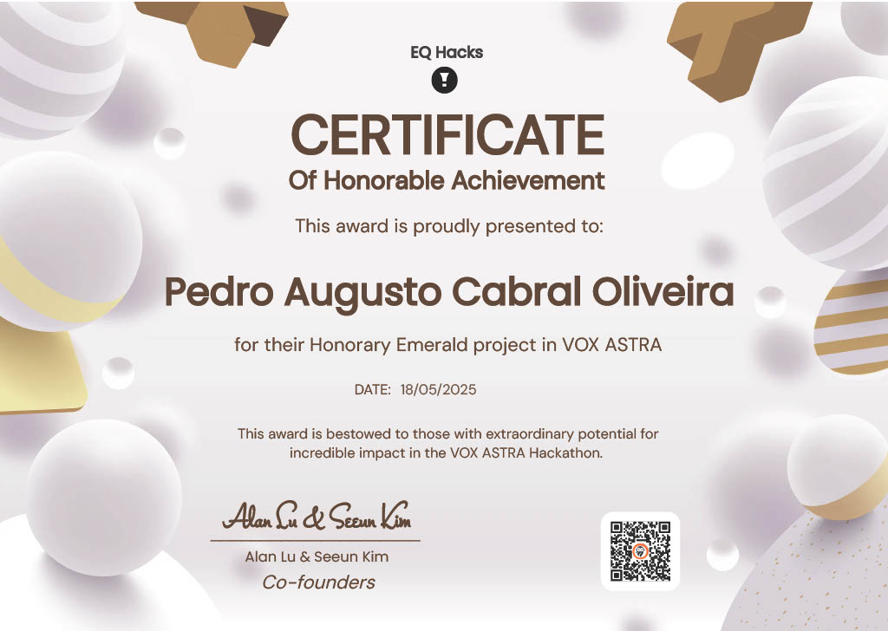

# 🏆 MediMentor
### AI-Powered Health Assistant | EQ Hacks Stanford Winner

<div align="center">



**🥇 Hackathon Winner - EQ Hacks Stanford University**

[](https://your-demo-link.com)
[](https://aws.amazon.com/)
[](https://www.isabelhealthcare.com)
[](LICENSE)

</div>

## 🌟 Overview

MediMentor is an award-winning AI-powered health assistant that revolutionizes symptom analysis and medical diagnosis support. Recognized as a **winner at EQ Hacks Stanford University**, this innovative platform bridges the gap between patients and healthcare professionals through intelligent symptom analysis powered by **Isabel Healthcare's** trusted medical database.

> **"Making reliable medical insights accessible to everyone"** - The vision that drove MediMentor to hackathon victory.

## 🎯 Impact & Value Proposition

### For Patients 👥
- **Instant Symptom Analysis**: Get immediate insights into potential conditions
- **Anxiety Reduction**: Understand symptoms before medical consultations
- **Health Literacy**: Receive clear, understandable medical information
- **24/7 Accessibility**: Access health insights anytime, anywhere

### For Healthcare Professionals 👨⚕️
- **Diagnostic Support**: AI-powered differential diagnosis assistance
- **Reduced Misdiagnosis**: Enhanced accuracy through data-driven insights
- **Time Efficiency**: Streamlined preliminary assessments
- **Evidence-Based Care**: Backed by Isabel Healthcare's medical database

## ✨ Key Features

- 🤖 **AI-Driven Analysis**: Advanced symptom processing with Isabel Healthcare API
- 🔐 **Enterprise Security**: AWS Cognito authentication & IAM permissions
- ⚡ **Serverless Architecture**: Scalable AWS Lambda backend
- 🌐 **Global CDN**: Fast content delivery via AWS CloudFront
- 📊 **Real-time Monitoring**: Comprehensive logging with AWS CloudWatch
- 📱 **Responsive Design**: Optimized for all devices
- 🏥 **Medical-Grade Data**: Powered by trusted healthcare APIs

## 📸 Application Screenshots

<div align="center">

### Home Interface


### Symptom Analysis Dashboard


</div>

## 🚀 Architecture & Deployment

### Cloud Infrastructure
```
┌─────────────────┐    ┌──────────────────┐    ┌─────────────────┐
│   AWS Amplify   │    │   AWS Lambda     │    │ Isabel Healthcare│
│   (Frontend)    │◄──►│   (Backend)      │◄──►│     API         │
└─────────────────┘    └──────────────────┘    └─────────────────┘
         │                       │                       
         ▼                       ▼                       
┌─────────────────┐    ┌──────────────────┐              
│  AWS CloudFront │    │  AWS API Gateway │              
│     (CDN)       │    │   (API Mgmt)     │              
└─────────────────┘    └──────────────────┘              
```

### AWS Services Stack
- 🌐 **Frontend**: AWS Amplify (Hosting & CI/CD)
- ⚡ **Backend**: AWS Lambda (Serverless Functions)
- 🔗 **API Management**: AWS API Gateway
- 🔐 **Authentication**: AWS Cognito
- 📊 **Monitoring**: AWS CloudWatch
- 🛡️ **Security**: AWS IAM
- 🚀 **CDN**: AWS CloudFront

### Quick Deployment
```bash
# Frontend deployment
amplify publish

# Backend deployment
serverless deploy
```

## 🛠️ Technology Stack

### Frontend
- **Languages**: HTML5, CSS3, JavaScript (ES6+)
- **Styling**: Responsive CSS with modern design principles
- **Deployment**: AWS Amplify with automated CI/CD

### Backend
- **Runtime**: Node.js
- **Architecture**: Serverless (AWS Lambda)
- **API Framework**: RESTful APIs with AWS API Gateway

### Cloud & DevOps
- **Cloud Provider**: Amazon Web Services (AWS)
- **Authentication**: AWS Cognito
- **Monitoring**: AWS CloudWatch
- **Security**: AWS IAM
- **CDN**: AWS CloudFront

### External APIs
- **Medical Data**: [Isabel Healthcare API](https://www.isabelhealthcare.com)
- **AI Processing**: Advanced symptom analysis algorithms

## 💡 Inspiration & Problem Statement

### The Challenge
In today's healthcare landscape, two critical problems persist:

1. **Patient Uncertainty**: Millions struggle to understand their symptoms, leading to:
   - Unnecessary anxiety and stress
   - Delayed medical consultations
   - Poor health decision-making

2. **Diagnostic Complexity**: Healthcare professionals face:
   - Time constraints in patient consultations
   - Risk of misdiagnosis in complex cases
   - Need for rapid, evidence-based diagnostic support

### Our Solution
MediMentor bridges this gap by democratizing access to **reliable, AI-powered medical insights**, making healthcare more accessible and efficient for everyone.

## 🔬 How It Works

### Real-Time Symptom Analysis
1. **Input**: Users describe their symptoms through an intuitive interface
2. **Processing**: Advanced AI algorithms analyze symptom patterns
3. **Integration**: Isabel Healthcare's medical database provides evidence-based insights
4. **Output**: Comprehensive analysis with potential conditions and recommendations

### Key Capabilities
- ⚡ **Instant Analysis**: Real-time symptom processing
- 🎯 **Accurate Results**: Powered by Isabel Healthcare's trusted database
- 📋 **Comprehensive Reports**: Detailed condition analysis and recommendations
- 🔄 **Continuous Learning**: AI models improve with each interaction

## 🏗️ Development Journey

### Architecture Design
Built with a **modern, scalable full-stack architecture**:

#### Frontend Development
- **Framework**: Vanilla JavaScript with modern ES6+ features
- **Design**: Mobile-first responsive design
- **Hosting**: AWS Amplify with automated deployments
- **Performance**: Optimized for fast loading and smooth UX

#### Backend Infrastructure
- **Runtime**: Node.js serverless functions
- **Platform**: AWS Lambda for infinite scalability
- **API Design**: RESTful architecture with AWS API Gateway
- **Security**: Enterprise-grade AWS Cognito authentication

#### Integration & Monitoring
- **Medical API**: Seamless Isabel Healthcare integration
- **Logging**: Comprehensive AWS CloudWatch monitoring
- **Security**: AWS IAM for granular access control
- **Performance**: AWS CloudFront for global content delivery

## 🚧 Technical Challenges & Solutions

### 1. Complex API Integration
**Challenge**: Seamless communication with Isabel Healthcare's medical API
**Solution**: Implemented robust error handling, request optimization, and data transformation layers

### 2. Medical UX Design
**Challenge**: Presenting complex medical data in user-friendly formats
**Solution**: Developed intuitive interfaces with clear visualizations and plain-language explanations

### 3. Scalability & Performance
**Challenge**: Ensuring system performance under varying loads
**Solution**: Leveraged AWS serverless architecture for automatic scaling and optimized response times

### 4. Security & Compliance
**Challenge**: Handling sensitive health information securely
**Solution**: Implemented AWS security best practices with encrypted data transmission and secure authentication

## 🏆 Key Achievements

### 🥇 Hackathon Victory
- **Winner at EQ Hacks Stanford University**
- Recognized for innovation in healthcare technology
- Demonstrated real-world impact and technical excellence

### 🔧 Technical Milestones
- ✅ **Successful API Integration**: Seamless Isabel Healthcare API implementation
- ✅ **Cloud Architecture**: Robust, scalable AWS infrastructure deployment
- ✅ **User Experience**: Intuitive interface design for complex medical data
- ✅ **Security Implementation**: Enterprise-grade authentication and data protection
- ✅ **Performance Optimization**: Sub-second response times for symptom analysis

## 📚 Key Learnings

### Healthcare Technology Insights
- **Data Reliability**: Critical importance of trusted medical data sources
- **Regulatory Awareness**: Understanding healthcare compliance requirements
- **User Trust**: Building confidence through transparent, accurate information

### Cloud Architecture Mastery
- **AWS Ecosystem**: Deep integration of multiple AWS services
- **Serverless Benefits**: Scalability and cost-effectiveness of serverless architecture
- **Security Best Practices**: Implementing robust security in cloud environments

### Product Development
- **User-Centered Design**: Simplifying complex medical information for diverse users
- **API Integration**: Best practices for third-party medical API integration
- **Performance Optimization**: Balancing functionality with speed and reliability

## 🚀 Future Roadmap

### Phase 1: Enhanced Intelligence
- 🧠 **Advanced ML Models**: Implement custom machine learning for improved diagnostic accuracy
- 📊 **Predictive Analytics**: Add health trend analysis and risk assessment
- 🔍 **Symptom Correlation**: Enhanced pattern recognition across symptom combinations

### Phase 2: Platform Expansion
- 📱 **Mobile Applications**: Native iOS and Android apps
- 🌐 **Multi-language Support**: Localization for global accessibility
- 🔗 **Additional APIs**: Integration with more medical databases and health tracking devices

### Phase 3: Collaborative Healthcare
- 👨⚕️ **Doctor Portal**: Professional dashboard for healthcare providers
- 💬 **Telemedicine Integration**: Direct patient-doctor communication tools
- 📋 **EHR Integration**: Seamless electronic health record connectivity
- 🏥 **Healthcare Network**: Partnership with medical institutions

### Phase 4: Advanced Features
- 🔬 **Lab Integration**: Connect with diagnostic lab results
- 📈 **Health Monitoring**: Continuous health tracking and alerts
- 🤖 **Personalized AI**: Individual health profile-based recommendations

## 📄 License

This project is licensed under the MIT License - see the [LICENSE](LICENSE) file for details.

---

<div align="center">

### 🏆 Award-Winning Healthcare Innovation

**MediMentor** - Bridging the gap between patients and healthcare professionals through AI

*Winner of EQ Hacks Stanford University*

[](https://github.com/yourusername/medimentor)
[](https://github.com/yourusername)

**Made with ❤️ for better healthcare accessibility**

</div>