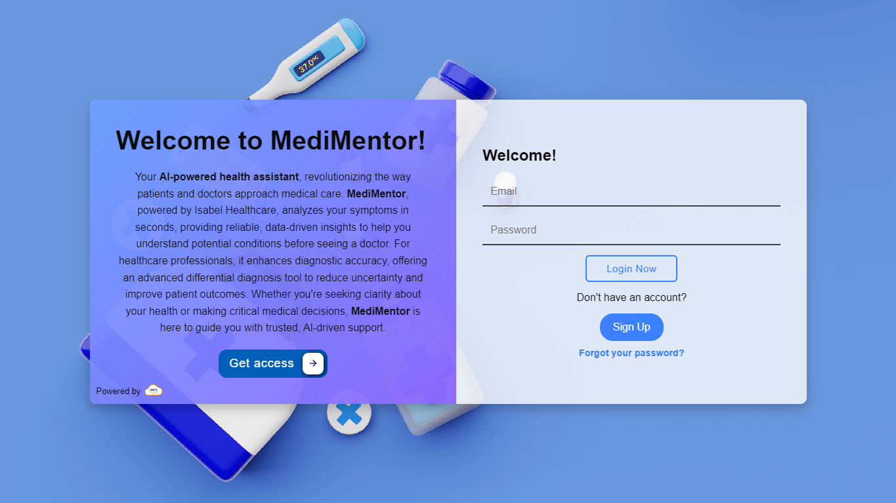
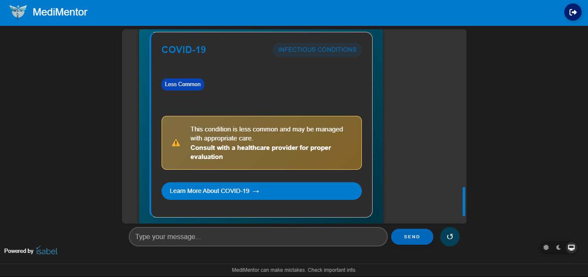
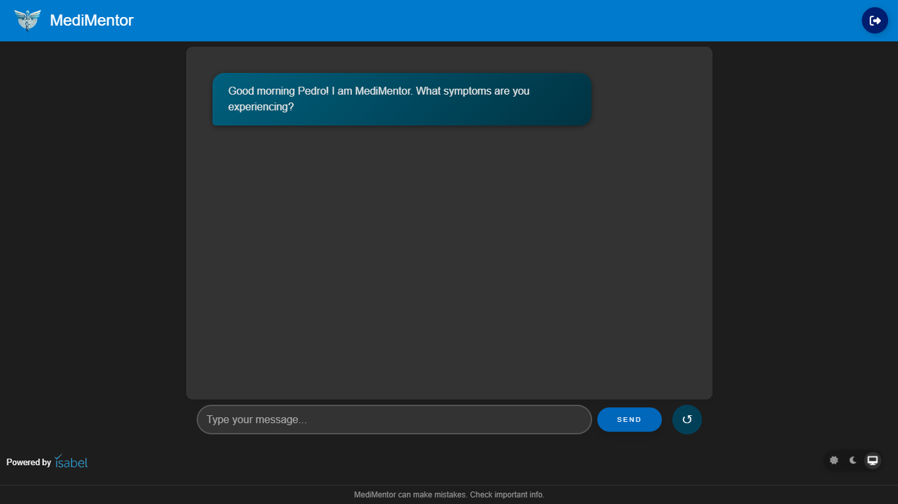

# MediMentor

MediMentor is an AI-powered health assistant that helps users analyze symptoms and receive personalized recommendations using advanced medical APIs. This project is powered by **Isabel Healthcare**, a leading provider of medical diagnosis tools. Learn more at [Isabel Healthcare](https://www.isabelhealthcare.com).

## How MediMentor Helps
MediMentor is designed to assist both **patients** and **healthcare professionals**:
- **For Patients**: Provides an easy way to analyze symptoms and receive possible conditions, helping users understand their health concerns before consulting a doctor.
- **For Doctors**: Enhances diagnostic accuracy by offering AI-powered differential diagnosis support, reducing the chances of misdiagnosis and improving patient outcomes.

## Features
- AI-driven symptom analysis powered by **Isabel Healthcare**
- Secure authentication with AWS Cognito
- Backend hosted on AWS Lambda
- Frontend deployed via AWS Amplify
- Integration with medical APIs such as Isabel Healthcare

## Screenshots



## Demo Video
[](public/assets/videos/tutorial.mp4)

## Deployment
MediMentor is deployed using AWS services:
- **Frontend**: AWS Amplify
- **Backend**: AWS Lambda with API Gateway
- **Monitoring & Logging**: AWS CloudWatch
- **Authentication**: AWS Cognito
- **Security & Permissions**: AWS IAM
- **Content Delivery**: AWS CloudFront

To deploy the project:
```sh
# Deploy frontend to AWS Amplify
amplify publish

# Deploy backend to AWS Lambda
serverless deploy
```

## Technologies Used
- **Frontend**: HTML, CSS, JavaScript
- **Backend**: Node.js, AWS Lambda
- **Authentication**: AWS Cognito
- **Hosting & Deployment**: AWS Amplify, AWS CloudFront
- **API Management**: AWS API Gateway
- **Logging & Monitoring**: AWS CloudWatch
- **Security & Access Management**: AWS IAM
- **Medical API**: [Isabel Healthcare](https://www.isabelhealthcare.com)

## Inspiration
The idea for MediMentor was born from the need to make **reliable medical insights accessible to everyone**. Many people struggle to understand their symptoms, leading to unnecessary anxiety or delayed medical care. Doctors also face challenges in diagnosing complex cases quickly. By leveraging AI and medical APIs, we aimed to create a tool that empowers both patients and healthcare professionals with **accurate, fast, and data-driven health insights**.

## What it does
MediMentor **analyzes symptoms in real time**, using advanced AI and Isabel Healthcare’s trusted database to generate potential conditions and recommendations. It provides **patients** with valuable insights into their symptoms and helps **doctors** by offering AI-assisted differential diagnosis support, ultimately improving decision-making and patient outcomes.

## How we built it
We built MediMentor using a **full-stack architecture**, leveraging:
- **Frontend**: Developed using HTML, CSS, and JavaScript, hosted on AWS Amplify.
- **Backend**: Built with Node.js and AWS Lambda, ensuring secure and scalable performance.
- **Authentication**: Integrated AWS Cognito for secure user management.
- **API Gateway**: Managed API requests efficiently between frontend and backend.
- **CloudWatch**: Monitored logs and performance for debugging and optimization.
- **IAM**: Managed secure access and permissions for AWS services.
- **CloudFront**: Optimized content delivery for faster load times.
- **Medical Data**: Powered by **Isabel Healthcare’s API** to deliver accurate health insights.

## Challenges we ran into
- **API Integration**: Ensuring smooth and efficient communication between MediMentor and Isabel Healthcare's API required fine-tuning request handling and data processing.
- **User Experience**: Designing an intuitive UI that presents complex medical information in an easy-to-understand format.
- **Scalability**: Optimizing the backend to handle increasing traffic without performance issues.

## Accomplishments that we're proud of
- Successfully integrating **Isabel Healthcare’s API** to provide **accurate, AI-powered symptom analysis**.
- Deploying a **secure and scalable** infrastructure using AWS services.
- Designing a **user-friendly interface** that simplifies complex medical insights for both patients and doctors.

## What we learned
- The importance of **reliable data sources** when dealing with health-related AI applications.
- Best practices for integrating **AWS services** like Cognito, Lambda, Amplify, API Gateway, CloudWatch, IAM, and CloudFront.
- The impact of **user-centered design** in making medical AI solutions accessible and easy to use.

## What's next for MediMentor
- **Enhancing AI capabilities**: Implementing machine learning models for even more accurate diagnostics.
- **Expanding API integrations**: Adding support for additional medical databases and real-time health tracking.
- **Mobile App Development**: Bringing MediMentor to iOS and Android for greater accessibility.
- **Doctor Collaboration Tools**: Enabling direct communication between users and healthcare professionals for personalized guidance.

## License
This project is licensed under the MIT License.
